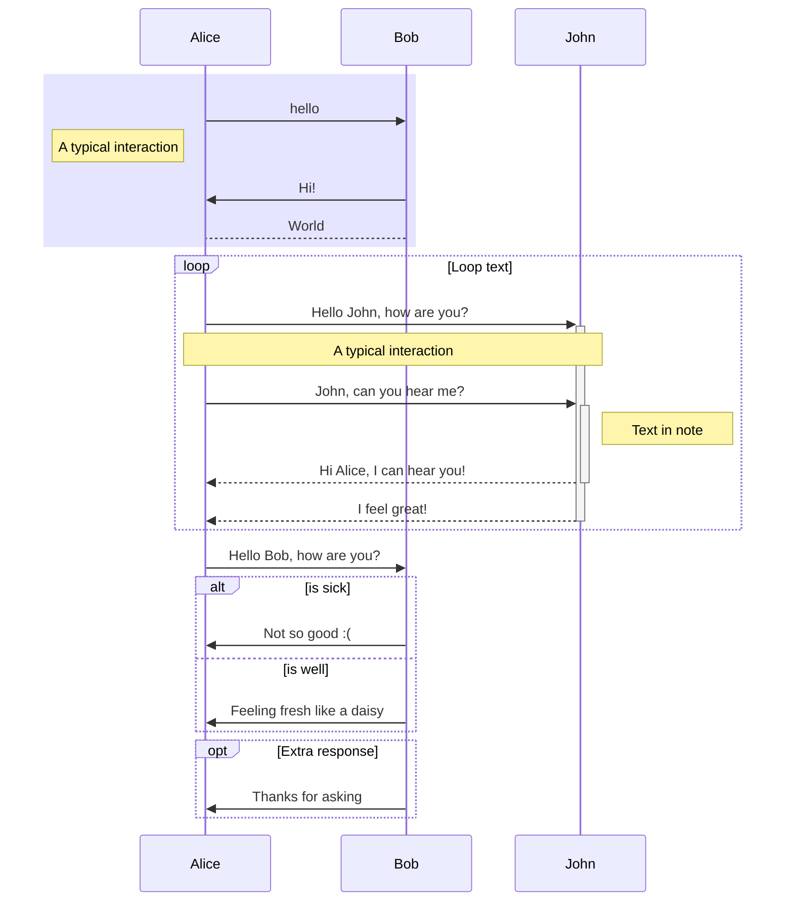
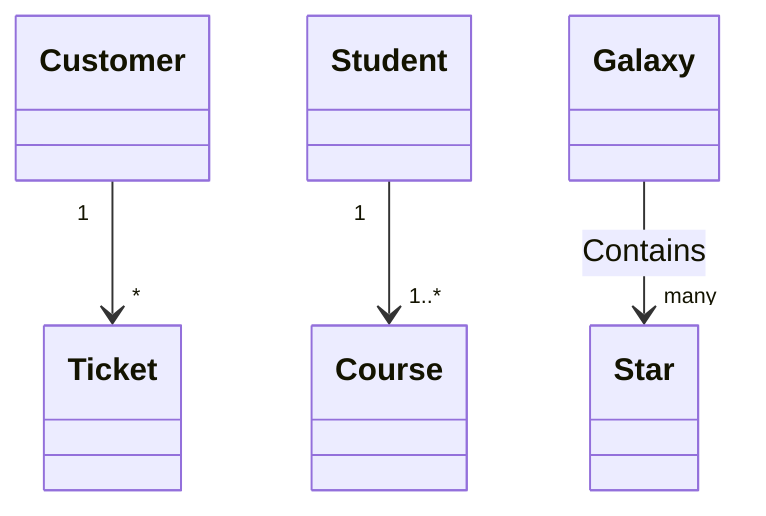

# HackMD GitHub Integration

One of the most important parts of a project is managing
documentation.  Readme files, how-tos, contributor 
workflows, user documentation, it all adds up quickly.  One
way to manage this is using markdown.  But what about those
sequence diagrams, domain class diagrams, and other software
diagrams?  Is there a way to write those using just your
text editor and some source control?  That's where HackMD
comes in.

HackMD is a web-based shared editing experience that
that integrates with GitHub.  It includes many enhancements
like [Mermaid Markdown Syntax](https://mermaid-js.github.io/mermaid)
rendering that make it a good complement to a project.

## Example Sequence Diagram

```
sequenceDiagram
  rect rgba(0, 0, 255, .1)
  Alice->>Bob:hello
  Note left of Alice: A typical interaction
  Bob->>Alice:Hi!
  Bob-->Alice:World
  end
  loop Loop text
  Alice->>+John: Hello John, how are you?
  Note over Alice,John: A typical interaction
  Alice->>+John: John, can you hear me?
  Note right of John: Text in note
  John-->>-Alice: Hi Alice, I can hear you!
  John-->>-Alice: I feel great!
  end
  Alice->>Bob: Hello Bob, how are you?
  alt is sick
      Bob->>Alice: Not so good :(
  else is well
      Bob->>Alice: Feeling fresh like a daisy
  end
  opt Extra response
      Bob->>Alice: Thanks for asking
  end
```



## Examle Class Diagram

